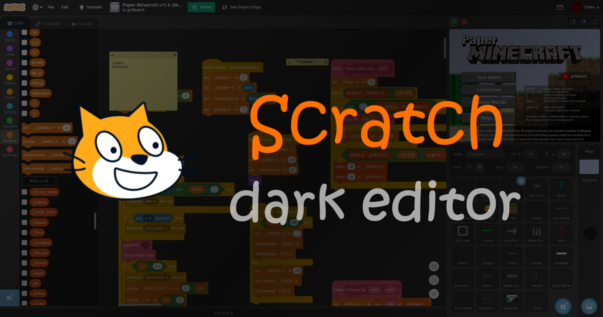

# Scratch Dark Editor

## Important note
This repository is intended to keep track of all changes made to my userstyle called 'Scratch Dark Editor' since update 3.0.0. I am welcome to any feedback regarding how the style could be improved. Do note that since this is a userstyle, it can only really make use of CSS to make changes to the editor. If you are looking for a way to add more features (like higher fps for your project), I advice you to look elsewhere. There are many other extensions and websites that will do exactly that. This project is only meant to alter the appearance of the editor, but not to add any further changes. To also make the website itself look somewhat darker, I would like to suggest you to try [Dark Theme for Scratch](https://userstyles.org/styles/173170/dark-theme-for-scratch), a userstyle made by [Eribetra](https://userstyles.org/users/565409).

## Features
Want to code with Scratch, but the editor is too bright? Then you have come to the right place! This style will make the online Scratch (3) editor darker so you can code in peace.

🎨 **It offers four different themes**:
- *Classic* for users that want a standard dark mode experience
- *Deep Black* for the ever-loving night coder
- *Sea Blue* for people that want to look beyond the shades of gray
- *Aquarium* for if Sea Blue doesn't quite cut it for you

🌈 **You can even change the default blue and orange to different custom theme colors!**

🖼️ **And finally, you can set a nice background image to really show that you mean business.**

## Installation
To install, please use a style manager extension like [Stylus](https://github.com/openstyles/stylus) or a userscript loader like [Tampermonkey](https://www.tampermonkey.net).
You can install this userstyle on [UserStyles.org](https://userstyles.org/styles/170879/dark-scratch-editor) (as a style/userscript) or by going to the Releases page of this project.

Alternatively, you can generate these files yourself by cloning this repository and running one of the following scripts:
- [build/exportStatic.py](build/exportStatic.py) will generate a static CSS file (in the /dist directory) with the options provided. Use `python3 build/exportStatic.py --help` for more information.
- [build/exportUserCSS.py](build/exportUserCSS.py) will generate a user.css file, also in the /dist directory
- [build/installUserCSS.py](build/installUserCSS.py) will run [build/exportUserCSS.py](build/exportUserCSS.py) and open it automatically in your default browser by using [build/openUserCSS.html](build/openUserCSS.html)

## Editing
The folder /style contains all of the actual css files. Run [build/watch.py](build/watch.py) to watch this directory and to compile to a user.css file on changes. You can open this user.css file in your browser and use the feature *'live reload'* of Stylus to automatically update the style while editing. The script [build/settings.py](build/settings.py) contains instructions on how the CSS files should be compiled depending on the preferences of the user. Please change this script if you want to edit these preferences.

## Image credits
The images used in this project are attributed to the following users:
- Space 1: [qimono](https://pixabay.com/users/qimono-1962238/) ([link to image](https://cdn.pixabay.com/photo/2016/10/20/18/35/earth-1756274_960_720.jpg))
- Space 2: [WikiImages](https://pixabay.com/users/wikiimages-1897/) ([link to image](https://cdn.pixabay.com/photo/2011/12/14/12/21/orion-nebula-11107_960_720.jpg))
- Cat 1: [bambi2192](https://pixabay.com/users/bambi2192-13359725/) ([link to image](https://cdn.pixabay.com/photo/2022/03/24/14/42/animal-7089224_960_720.jpg))
- Cat 2: [Pexels](https://pixabay.com/users/pexels-2286921/) ([link to image](https://cdn.pixabay.com/photo/2016/11/19/17/33/animal-1840495_960_720.jpg))
- Dog 1: [moshehar](https://pixabay.com/users/moshehar-7046690/) ([link to image](https://cdn.pixabay.com/photo/2018/01/09/11/04/dog-3071334_960_720.jpg))
- Dog 2: [ElvisClth](https://pixabay.com/users/elvisclth-448505/) ([link to image](https://cdn.pixabay.com/photo/2016/05/09/10/42/weimaraner-1381186_960_720.jpg))
- Horse: [christels](https://pixabay.com/users/christels-3741991/) ([link to image](https://cdn.pixabay.com/photo/2018/06/21/20/50/horse-3489428_960_720.jpg))
- Wolf: [christels](https://pixabay.com/users/christels-3741991/) ([link to image](https://cdn.pixabay.com/photo/2017/09/24/18/15/wolf-2782626_960_720.jpg))
- Venice: [-inactive account-](https://pixabay.com/users/12019-12019/) ([link to image](https://cdn.pixabay.com/photo/2016/12/27/09/24/grand-canal-1933559_960_720.jpg))
- Red rose: [moshehar](https://pixabay.com/users/moshehar-7046690/) ([link to image](https://cdn.pixabay.com/photo/2018/01/29/07/11/flower-3115353_960_720.jpg))
- Chess: [Pexels](https://pixabay.com/users/pexels-2286921/) ([link to image](https://cdn.pixabay.com/photo/2016/11/21/17/50/king-1846807_960_720.jpg))
- Soccer/Football: [CoxinhaFotos](https://pixabay.com/users/coxinhafotos-3726685/) ([link to image](https://cdn.pixabay.com/photo/2017/08/25/16/15/ball-2680595_960_720.jpg))
- Hacking: [Gordon Johnson](https://pixabay.com/users/gdj-1086657/) ([link to image](https://cdn.pixabay.com/photo/2017/05/29/18/22/matrix-2354492_960_720.jpg))
- UFO: [Thomas Budach](https://pixabay.com/users/tombud-1908037/) ([link to image](https://cdn.pixabay.com/photo/2016/03/18/15/02/ufo-1265186_960_720.jpg))
- Minecraft: [valeravenegretvv](https://wallpapers.com/wallpapers/4d-minecraft-cube-gyq5l01m2bzys58p.html) ([link to image](https://wallpapers.com/images/high/4d-minecraft-cube-gyq5l01m2bzys58p.jpg))
- Roblox: [svettyk86](https://wallpapers.com/wallpapers/cool-3d-roblox-avatar-e5o3rq8aiudhydd6.html) ([link to image](https://wallpapers.com/images/high/cool-3d-roblox-avatar-e5o3rq8aiudhydd6.jpg))

If you feel that an image is misattributed or if you are the owner of one of these images and you do not want to include your work in this project, please open an issue in this repository.
